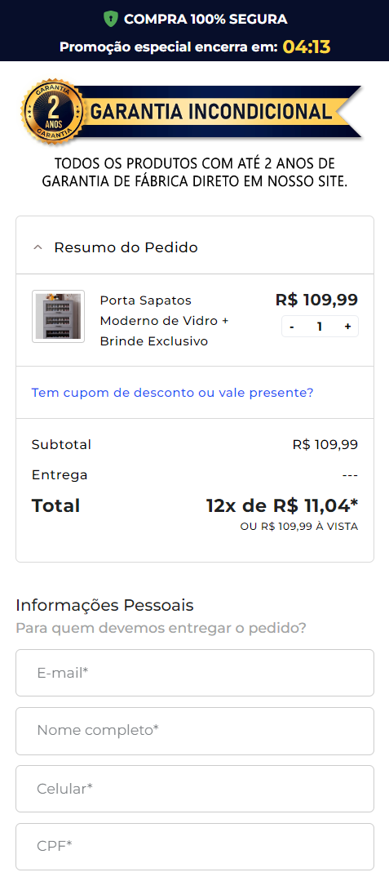
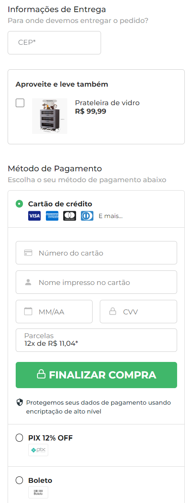

<h1 align="center"> Checkout Transparente 💸 </h1>

Trata-se de um checkout transparente que utiliza a API da Appmax como gateway de pagamento. O projeto foi desenvolvido a serviço de uma empresa, por isso o presente repositório é apenas uma demonstração do resultado final, estando o código em outro repositório privado. 

 

  
  

 

## 🚀 Tecnologias

Esse projeto foi desenvolvido com as seguintes tecnologias:

- ReactJS
- Node
- API da Appmax
- Git e Github
